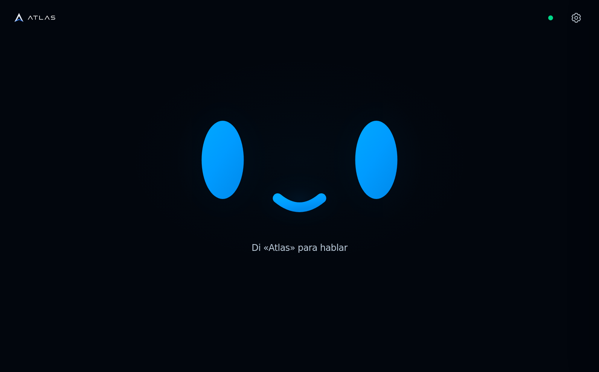
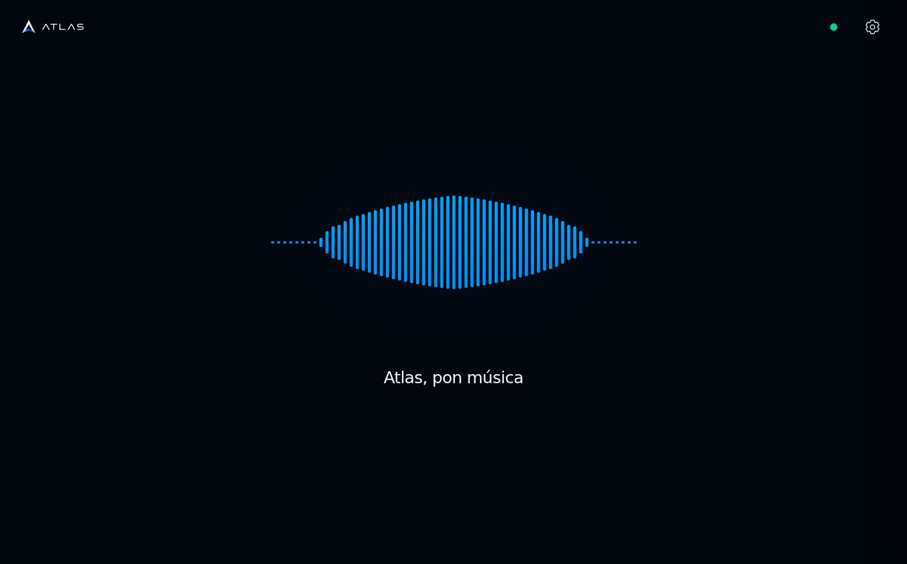
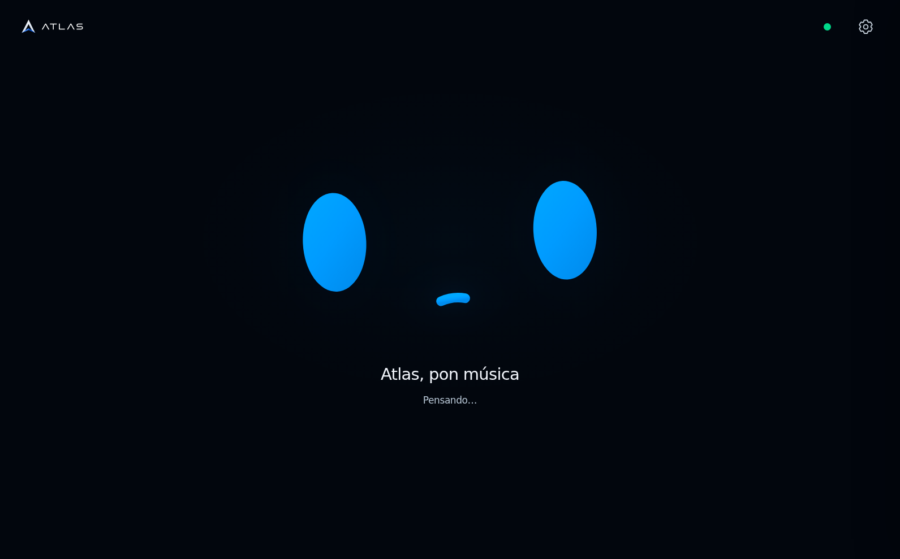
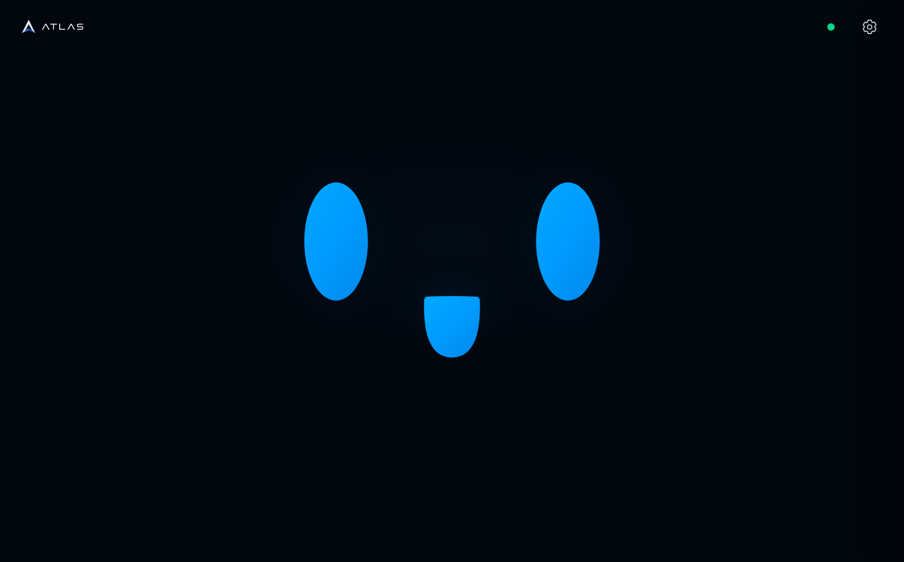
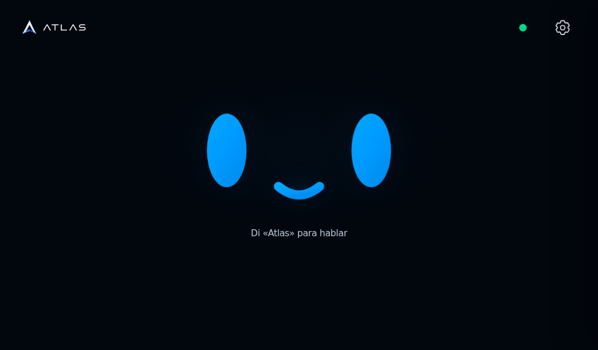

# ATLAS face — WebScreen presentation

This is a separate presentation of the existing WebScreen, not a second voice
agent. `atlas-screen --atlas-new` selects `/new/?kiosk=1` on the physical A1.
The original `/` and `atlas-screen --atlas` remain available for debugging.
Both use the same access lease, Realtime controller, settings, tools, context,
voice output and recovery rules. Every new spoken request requires **ATLAS**.

## Approved visual specification

The approved landscape reference is the minimal HUD concept, 1591 × 989.
Only the small ATLAS brand at top left, connection dot and settings control at
top right, the central face and “Di «Atlas» para hablar” appear while ready.
No permanent dock, transcript history, quota cards or debug labels are added.
Existing controls stay available inside the tools/settings surface.

- Background: almost-black blue, approximately `#02060d`; no decorative panels.
- Face: vivid `#00a8ff`/`#009bff`/`#008cee` with a restrained blue luminous gradient.
- Text: muted off-white, regular sans serif; idle caption approximately 24 px
  at the reference width, scaled down for the A1 and handheld viewports.
- Eyes: two tall ovals, approximately 112 × 208 px in the reference, centered
  near x=595/1004 and y=425. Smile centered near x=799, y=540.
- Face and caption occupy the center with generous negative space. Header
  touch targets remain usable even though their visible icons are small.
- Custom vector geometry and browser animation are explicitly requested:
  do not use the screenshot as a fake full-screen UI or regenerate the mascot.
- New optional controls use the same dark palette, quiet borders and blue
  accents; focus visibility and reduced-motion support are required.

## State and audio contract

`static/new/face.js` and `face.css` own geometry, layout and animation.
`static/new/audio.js` is a read-only presentation bridge. The existing
`app.js`/`realtime.js` remain the only conversation controllers.

`window.AtlasFace` exposes `update`, `transcript`, `inputLevel`, `outputLevel`,
`connection` and `speechBoundary`. A visual callback must never send a prompt,
take ownership, enable a microphone, change an audio route or replay a tool.

1. Ready: the default smiling face, with occasional soft blinks. Each blink
   closes/reopens in approximately 350 ms, with an 8.7 s start-to-start interval.
   A sparse timer starts one CSS animation; there is no permanent idle
   animation or idle animation-frame loop. Leaving idle, hiding the page/view,
   `pagehide` and reduced-motion preference cancel the blink timers.
2. Wake accepted: face transforms into a horizontal blue waveform. It follows
   measured microphone RMS/dBFS; recognized words appear below in white.
3. Input ended / processing: face returns with a restrained thinking motion.
4. Actual playback: mouth opens in time with the output envelope or browser
   speech boundaries. Text generation alone is not audible speech.
5. Playback ended: return to wake-word waiting; no ten-second follow-up window.

RMS is a relative digital level, not a calibrated sound-pressure reading.
Silence must produce a quiet waveform/closed mouth, not invented audio.
Animation work is bounded, stops on hidden pages and honors reduced motion.
Unchanged captions, transcripts, connection indicators and drawing values do
not rewrite the DOM. The blink timing and visual geometry are independent of
the voice session and never trigger a reconnect.

## Bounded transport recovery

These safeguards apply to both the original and new presentation:

- **Authorization evidence (`static/access.js`):** a successful protected API
  request already renews the server's 20-second lease. The client now also
  counts that evidence inside its existing eight-second grace window, so an
  isolated stalled heartbeat does not discard otherwise authorized activity.
  Evidence is tied to the same token/generation and the request's start time,
  not its delayed completion. It cannot revive an expired/revoked owner or an
  aborted request. Public health/static/access reads and failed requests are
  not proof of ownership; authoritative `401`/`423` still revoke immediately.
  Access requests retain their four-second total deadline.
- **One reconnect scheduler (`static/app.js`):** duplicate fallback/startup
  errors share one timer and one reconnect-screen update. Retries back off
  through 1, 2, 4 and at most 8 seconds. A briefly ready connection does not
  reset that history; the next failure resets it only after at least 20
  seconds of stable readiness. Stale startup failures cannot disrupt a ready
  replacement, and losing control or leaving ATLAS prevents the queued retry.
- **WebRTC recovery (`static/realtime.js`):** an established peer gets eight
  seconds to recover a transient ICE disconnect without losing its admitted
  turn. Moving from `disconnected` to `connecting` keeps the original deadline;
  it does not extend it indefinitely. Only `connected` confirms recovery;
  failed/closed transport still initiates recovery.
- **Open-channel warnings:** an RTC data-channel error while that same channel
  remains open is logged as `session.channel_warning`, without immediately
  discarding playback or restarting the session. ICE, startup and response
  deadlines remain authoritative, as do provider authentication errors and
  closing/closed channels. No prompt or tool is automatically replayed.

These are tested resilience and rendering-efficiency improvements, not proof
that every physical audio microcut is resolved. The connection safeguards and
blink optimization must not be presented as the cause of the shared-memory
growth; the controlled transport comparison below identifies a different path.

### Shared-memory investigation: controlled Pi comparison

A controlled reproduction in Chrome on the Raspberry Pi isolated unconsumed
JSON response bodies from fire-and-forget POST requests. With the response body
ignored, 40 requests increased the renderer's shared-memory allocation from
**16.05 MiB to 96.05 MiB**, exactly **2 MiB per request**. Repeating 40 equivalent
requests while consuming each response with `response.text()` kept allocation
flat at **96.05 MiB**. Another 40 responses cancelled with `response.body.cancel()`
also added zero shared-memory allocation relative to that phase's baseline.

This A/B result identifies unconsumed response bodies as a reproducible cause
of the allocation growth on this Chrome setup. The corresponding runtime path
is fire-and-forget log/event POSTs that did not drain their responses. Build
`2026-09-07-connection-4` explicitly releases those bodies, including error
responses and backend cancellation acknowledgements. A four-second deadline
bounds headers and body; late replies are cancelled. At most 64 telemetry
requests may be in flight, with no offline queue and no automatic replay.
Cancellation is independent of that telemetry ceiling. Access-release and
authoritative access-rejection bodies are also explicitly discarded.

The patch is installed. Eight measurements at 45-second intervals, from
00:36:08 to 00:41:23 CEST on 2026-09-07, kept the same browser and renderer.
Renderer shared memory went from **10.058 MiB to 0.026 MiB**, with **zero
retained 2 MiB blocks in every sample**. There were 74 new-build events since
deployment (63 within the 5 min 15 s sampling window), 209 HTTP 200 responses,
no HTTP 4xx/5xx, Realtime errors, unexpected reconnects or watchdog recovery.
The two planned browser restarts before this final window were maintenance,
not spontaneous failures; no process was restarted during sampling. This does not
establish that all audible microcuts have the same cause or prove indefinite
network/session availability.

For comparison, an isolated no-audio presentation fixture did not reproduce
the growth with the earlier continuous blink. The sparse blink remains a
rendering-efficiency improvement, not the demonstrated leak fix.

## Source map

- [WebScreen runtime](README.md) and [Realtime instructions](REALTIME_INSTRUCTIONS.md).
- [Screen command](../../openclaw/workspace/atlas-commands/ATLAS-SCREEN.md).
- [Connection map](../../openclaw/workspace/ATLAS-CONNECTIONS.md).
- `server.py::render_new_design_shell`: serves the existing DOM at `/new/`
  with presentation assets. No second HTML copy or duplicate credential flow.

## Browser verification

The real `AtlasScreenHandler` route at `http://127.0.0.1:5057/new/` was checked
in the Codex in-app browser with the shared controllers unmodified. The checks
covered the minimal header, settings drawer opening/closing and focus return,
unique real voice/reasoning selector elements, no horizontal overflow and no
browser error/warning logs. This local backend was intentionally incomplete;
these checks do not establish a live voice conversation.

Separate isolated checks used Chromium/Google Chrome through Playwright in
the subagent environment, where the Browser skill was unavailable. The native
reference viewport was **1591 × 989**; the same layout was also checked at
**1024 × 600** and **390 × 844** without horizontal overflow or clipped primary
controls.

Two isolated checks cover different layers:

- **DOM/presentation harness:** renders the shared document and `face.js`,
  with controlled states and equivalent drawer handlers. It verifies the
  exact idle caption, unique DOM IDs, settings open/close and Escape,
  voice/reasoning selectors, microphone control, expandable diagnostics,
  white transcription text, thinking/speaking states, return to idle and
  reduced-motion styling. This is not proof of a live backend session.
- **Audio bridge in a real browser:** a generated oscillator is routed into
  a real `MediaStream` and measured as PCM by the presentation bridge.
  Nonzero PCM opens the mouth; zero PCM closes it. Actual buffer-playback
  events, rather than response text completion, control the speaking state.
  Measured input PCM drives the waveform, silence changes it to thinking,
  and returning input restores listening without discarding the transcript.
  The test uses no microphone permission, model request or hardware speaker
  output; Chrome output is muted for the isolated test.

Both checks completed without JavaScript page errors. They establish browser
rendering and audio-envelope integration, **not physical wake detection,
spoken-word recognition, acoustic echo cancellation or speaker audibility**.
The 1024 × 600 image is a browser viewport matching the A1 screen, not a
photograph or capture of the physical Raspberry Pi display.

The one-shot blink was additionally checked in real Chromium: zero active
animations at rest, two 350 ms single-iteration eye animations during a blink,
then zero again. One hundred identical idle/status updates produced zero DOM
mutations and zero requested animation frames; hidden content produced no
frames. Screenshots were visually reviewed with unchanged face geometry and
layout. The dependency-free regressions are in `test_face_idle.cjs`; the
protected-traffic, reconnect-scheduler and ICE/channel cases are covered by
`test_access_client.cjs`, `test_reconnect_scheduler.cjs` and
`test_voice_reliability.cjs` respectively.

### Installed A1 verification — 2026-09-06

The new route and assets were installed on A1 with dated backups. Both
`atlas-webscreen.service` and `atlas-screen-kiosk.service` are active;
`atlas-screen` reports `atlas-new` as selected and visible for both the normal
user and root. The private-pipe watchdog reports a responding ATLAS document,
and the local kiosk loaded every `/new/` asset and opened its Realtime session.
The settings file hash is unchanged, including the saved Ash voice. Startup
policy remains unchanged (`atlas`); this preview does not silently become the
boot default.

[Live A1 capture](../../docs/images/webscreen-new/pi-live.png) is an unedited
1024 × 600 capture of the actual X11 display after deployment and the slightly
faster blink adjustment. It shows the ready face and green status indicator.
This proves the installed display state, not room-microphone recognition or
speaker audibility. Those physical voice behaviors still need a spoken test.

The integrated JavaScript verification passed **217 tests: 204 WebScreen and
13 system watchdog tests**, including response cleanup, with no model calls:

```bash
node --test .atlas/webscreen/test_*.cjs system/test_kiosk_watchdog.cjs
```

Run that command from the repository root. The preceding installed-build
verification also passed 77 WebScreen Python and 85 system Python tests:
**379 automated tests in total**.
Isolated real-Chrome watchdog checks also recovered
a deliberately crashed renderer and a failed page load without changing the
selected design or opening a debugging network port. This is not a long-term
stability guarantee.

### Visual fidelity review

The approved image and browser screenshots were inspected directly. The
checks covered the eye proportions and positions, rounded smile, dark-blue
background and luminous blue palette, minimal header, caption typography,
negative space, and responsive geometry. The idle copy matches the approved
“Di «Atlas» para hablar”; debug content is absent until settings is opened.
The official ATLAS PNG/SVG assets replace the generated reference's tiny
brand lettering intentionally. The listening, thinking and speaking states
extend the approved idle design with the requested native animation.

## Rendered screenshots

These PNGs are unedited browser captures of controlled verification states,
not generated mockups or evidence of a completed live voice conversation.
The idle capture comes from the presentation harness; the other captures
come from the PCM/MediaStream browser check described above.

| State | Browser capture |
| --- | --- |
| Ready, 1591 × 989 | [Idle face](../../docs/images/webscreen-new/idle.png) |
| Measured input and recognized-text fixture | [Listening](../../docs/images/webscreen-new/listening.png) |
| Input silence | [Thinking](../../docs/images/webscreen-new/thinking.png) |
| Nonzero playback PCM | [Speaking](../../docs/images/webscreen-new/speaking.png) |
| A1-sized viewport, 1024 × 600 | [Small landscape screen](../../docs/images/webscreen-new/pi-1024x600.png) |










