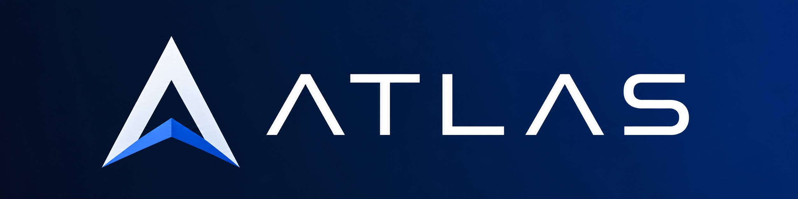
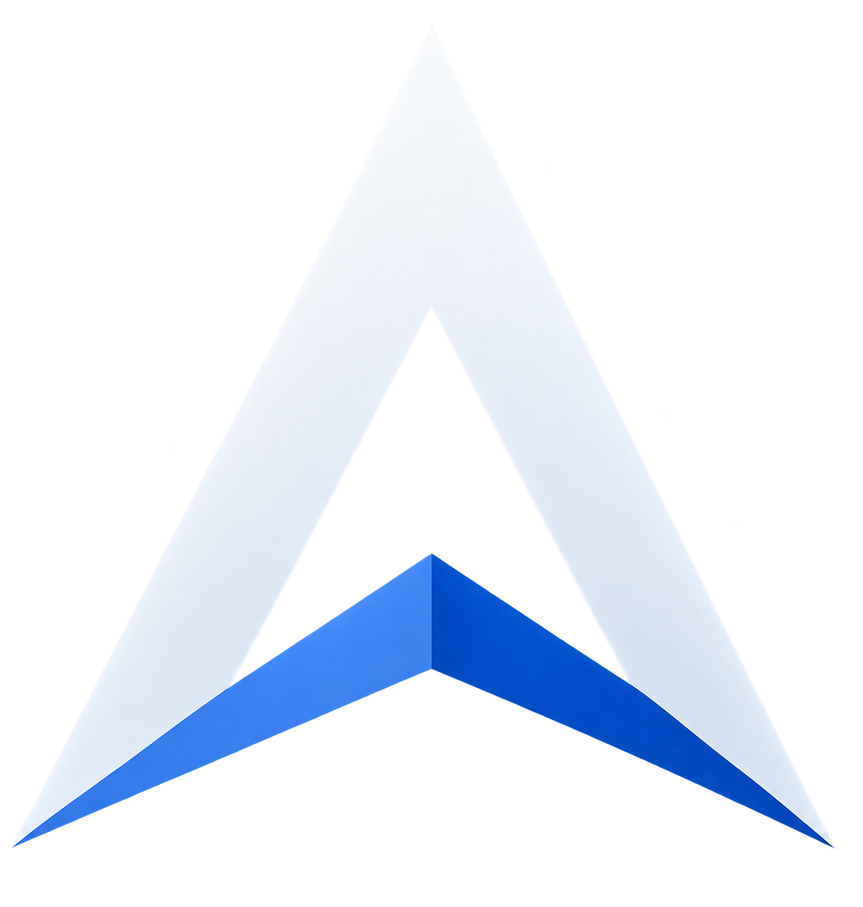
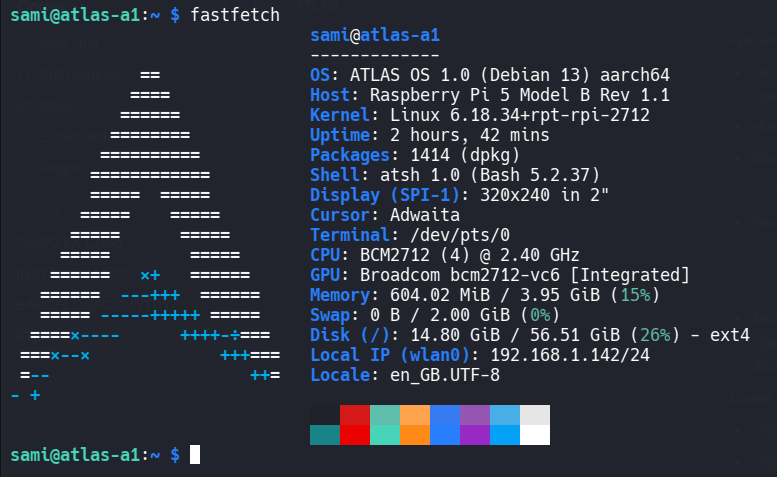

<p align="center">
  
</p>

<h1>
  
  ATLAS
</h1>

ATLAS es un prototipo de agente de inteligencia artificial físico, personalizable y de bajo coste. Integra OpenClaw, modelos de lenguaje, memoria persistente, herramientas del sistema y distintos canales de comunicación en un dispositivo dedicado.

El objetivo no es presentar ATLAS como una inteligencia consciente ni como un modelo creado desde cero. El proyecto estudia cómo desplegar, configurar, personalizar y evaluar un agente basado en tecnologías abiertas para que pueda ejecutar tareas concretas de forma útil, natural y verificable.

## Qué es ATLAS

ATLAS busca superar el enfoque rígido de los asistentes basados únicamente en comandos predefinidos. Puede interpretar peticiones en lenguaje natural, utilizar tools, consultar memoria, interactuar con el sistema y coordinar acciones dentro de los límites definidos por el usuario.

OpenClaw funciona como núcleo de software y conecta:

- Large Language Models (LLM), principalmente mediante servicios en la nube.
- Memoria y contexto persistentes escritos en Markdown.
- Tools, skills, scripts y servicios del sistema.
- Channels como Telegram, interfaces web y futuras integraciones.
- Pipelines de Speech-to-Text (STT) y Text-to-Speech (TTS).

ATLAS es la capa de identidad, comportamiento, integración, automatización y experiencia física construida alrededor de esa base.

## Objetivos

- Mantener conversaciones por texto y, progresivamente, por voz.
- Recordar preferencias concretas del usuario de forma estructurada.
- Ejecutar tareas mediante tools y comandos del sistema.
- Mostrar información en una pantalla dedicada.
- Integrar canales de comunicación y servicios externos.
- Detectar e interpretar determinados periféricos conectados.
- Recuperar sus servicios después de un reinicio.
- Evaluar cada función mediante éxito, errores y tiempo de respuesta.

## ATLAS A1

ATLAS A1 es la primera implementación física del proyecto. Actualmente se ejecuta en una Raspberry Pi 5 con 4 GB de RAM.

La Raspberry Pi actúa como Gateway, entorno de ejecución y punto de conexión con el hardware. Los modelos más grandes se ejecutan normalmente en la nube; los modelos locales se reservan para tareas compatibles con los recursos disponibles, como determinados procesos de STT, TTS o experimentación con modelos pequeños.

La pantalla actual es una SunFounder TS7 Pro táctil de siete pulgadas y resolución 1024 × 600. El diseño físico completo, el audio, el micrófono y la carcasa se documentarán conforme avance el prototipo.

## Software

ATLAS OS 1.0 está basado en Debian 13 para arquitectura `aarch64` y personalizado para funcionar como sistema dedicado de ATLAS. Incluye la identidad visual del proyecto, OpenClaw, servicios persistentes y comandos específicos para controlar el dispositivo.

<p align="center">
  
</p>

La versión mostrada utiliza:

- Hostname `atlas-a1`.
- Identidad `ATLAS OS 1.0 (Debian 13)`.
- Shell presentada como `atsh 1.0`, basada en Bash.
- Fastfetch y Neofetch con identidad visual propia.
- OpenClaw como Gateway del agente.

### WebScreen y conversación por voz

El código de [`ATLAS WebScreen`](.atlas/atlas-webscreen) incluye una interfaz de depuración con cuatro vistas: ATLAS, Transcripción, Texto a voz y Ajustes.

Una sola pestaña controla WebScreen a la vez. Otros clientes pueden reclamar acceso cada diez segundos; el propietario recibe una notificación y puede delegarlo cuando ATLAS está en espera. El cambio conserva la conversación y desactiva el micrófono y el audio de la pestaña anterior. Este control de uso no sustituye una futura autenticación.

- Wake word `ATLAS`, sin locución de confirmación, y cierre del turno tras setecientos milisegundos de silencio.
- Transcripción nativa del navegador mediante Speech Recognition. Su disponibilidad depende del navegador y puede utilizar servicios remotos; no se presenta como STT offline. Whisper sigue disponible para los demás canales y como fallback.
- TTS del navegador o ElevenLabs, con Voice ID configurable y texto preparado para voz en español.
- Una conexión persistente al Gateway y un oyente caliente del mismo agente OpenClaw, actualmente con GPT-5.6 Luna.
- Respuesta directa para conversación sencilla, juegos y conocimiento general cuando Luna tiene suficiente contexto. Si necesita herramientas, información privada o acciones, delega al turno principal.
- Historial breve compartido y estado de juego para mantener la continuidad. Hora y fecha simples se resuelven con el reloj del sistema en Europe/Madrid.
- Preámbulos y avances de trabajo, reproducción por frases con TTS del navegador, interrupción mediante `ATLAS` y continuación automática cuando se espera una respuesta.
- Cancelaciones sencillas sin LLM y logs por interacción para medir tiempos y depurar.

La vía rápida y el turno principal son ejecuciones distintas del mismo agente, no dos identidades diferentes. El contexto conversacional se renueva tras treinta minutos sin actividad. El historial rápido vive en memoria y se vacía al reiniciar WebScreen; no sustituye la memoria duradera de OpenClaw.

### Pantalla y terminal local

`atlas-screen` muestra el estado y permite elegir `--desktop`, `--terminal`, `--atlas` o `--rafas`. `on` abre el modo seleccionado y `off` apaga la salida; la pantalla permanece apagada por defecto al reiniciar. Las opciones se pueden combinar: `atlas-screen --atlas --on` abre WebScreen en Google Chrome kiosko sobre localhost, conservando el acceso por red. El cursor se oculta cuando no hay un ratón USB/Bluetooth conectado.

La terminal usa Zsh con autocompletado, highlighting y **ATLAS TOUCH TYPE**, el teclado táctil oscuro. Un doble toque abre el teclado sin tapar la zona de escritura; un toque lo cierra y dos dedos permiten recorrer el historial. El zoom cambia la letra y reajusta las líneas sin cambiar la ventana. Esta terminal tiene acceso root local: úsala únicamente en un dispositivo bajo tu control. RAFAS es su alternativa de recuperación sin entorno gráfico.

## Workspace de OpenClaw

El directorio [`openclaw/workspace`](openclaw/workspace) contiene la base pública del contexto de ATLAS.

- `AGENTS.md`, `IDENTITY.md` y `SOUL.md` conservan el comportamiento e identidad definidos para ATLAS.
- `USER.md`, `MEMORY.md`, `TDR.md`, `ENVIRONMENT.md` y `HEARTBEAT.md` se distribuyen como templates sin datos personales.
- `TOOLS.md` sirve como guía local para documentar hardware, rutas y herramientas de cada instalación.
- `VARIABLES.md` y `ADB_CONTROL.md` son templates; `atlas-commands/` contiene las instrucciones de los comandos para el agente.

Los tokens, API keys, sesiones, credenciales, historiales, datos personales y configuraciones privadas no forman parte del repositorio ni de las imágenes publicadas.

## Comandos de ATLAS

La carpeta [`atlas-commands`](atlas-commands) contiene los comandos `atlas-*` utilizados para gestionar audio, pantalla, casting, estado del sistema, TTS y servicios del dispositivo. Cada comando se acompaña de una descripción breve y ejemplos de uso.

## Estructura del repositorio

Las [herramientas misceláneas](misc/README.md) reúnen [ATLAS TOUCH TYPE](misc/atlas-touch-type/README.md) y [RAFAS](misc/rafas/README.md), con su código y notas de instalación.

```text
ATLAS/
├── .atlas/                 Runtime público: WebScreen, desktop, pantalla y proyectos
├── assets/                 Recursos visuales y capturas
├── atlas-commands/         Comandos de administración de ATLAS A1
├── docs/                   Notas de versiones y documentación técnica
├── misc/                   ATLAS TOUCH TYPE, RAFAS y herramientas misceláneas
├── openclaw/workspace/     Identidad pública y templates de OpenClaw
├── system/                 Helpers, servicios, terminal, HDMI y personalización
├── README.md               Presentación del proyecto
└── SECURITY.md             Política de publicación segura
```

## Estado actual

ATLAS se encuentra en desarrollo activo. La versión 1.0 establece la identidad del agente, su sistema operativo base, el Gateway de OpenClaw, el contexto persistente y las primeras herramientas de control.

La voz, la pantalla táctil y las herramientas de recuperación están en desarrollo activo. El código de este repositorio avanza por delante de la imagen de la release 1.0: esta actualización no genera ni sustituye ninguna imagen del sistema. Consulta el [mapa de instalación y límites actuales](.atlas/README.md).

## RAFAS

RAFAS significa ***Recovery Access For ATLAS Systems***. Su primera implementación ya permite abrir una consola de recuperación local independiente del entorno gráfico, de OpenClaw y de la red.

Durante el desarrollo de ATLAS A1 fueron apareciendo errores e incidencias. Habitualmente, ATLAS podía resolverlos por sí mismo o recuperarse mediante sus herramientas de auto-reparación. Sin embargo, algunos fallos afectaban al propio Gateway de OpenClaw, al provider del modelo —por ejemplo, OpenAI— o a NetworkManager. En esas situaciones, ATLAS entraba en un estado de hibernación operativa y no podía reparar el problema desde dentro.

Hasta entonces, la alternativa era conectarse por SSH a la terminal de ATLAS OS y resolverlo manualmente. Esto se volvía especialmente complicado si el fallo estaba relacionado con la conectividad: si la Raspberry Pi no conseguía conectarse a Internet, tampoco era posible acceder a ella por red.

Con la incorporación de la pantalla al ATLAS A1 surgió RAFAS. Con un teclado USB, mantén Ctrl y pulsa W, O, W. La pantalla se enciende y muestra el logo de ATLAS y el título R.A.F.A.S. en blanco, junto a una shell root en `/home/atlas`. También se abre con `atlas-screen --rafas --on`. Funciona desde los modos apagado, desktop, terminal o Atlas; no necesita Chrome ni Xorg.

Un pequeño servicio espera eventos del teclado, sin sondeo periódico ni registro de pulsaciones. Se inicia con el sistema y se reinicia si falla. No es un sistema operativo alternativo: necesita que Linux, systemd, el teclado y la pantalla sigan funcionando.

**Esta versión de desarrollo ofrece acceso root local sin contraseña adicional.** Está pensada exclusivamente para dispositivos bajo control de su propietario. La autenticación y las herramientas visuales de recuperación se incorporarán más adelante. [Código, funcionamiento y límites](misc/rafas/README.md).

### Roadmap

- Desarrollar **ATLAS Imager** para Windows y Linux.
- Descargar, verificar, descomprimir y grabar automáticamente la imagen oficial de ATLAS OS.
- Permitir el provisioning previo de Wi-Fi, hostname, usuario, contraseña y claves SSH sin incluir estos datos en la imagen pública.
- Definir un formato de configuración versionado para que ATLAS Imager y ATLAS OS sean compatibles entre versiones.

## Releases

Las imágenes saneadas de ATLAS OS y sus notas de versión se publican en [GitHub Releases](../../releases). Se distribuyen comprimidas como `.img.xz`; ATLAS Imager podrá descargarlas y preparar cada instalación con la configuración elegida por su propietario. Una imagen pública nunca debe contener redes Wi-Fi, tokens, API keys, cookies, sesiones, claves SSH ni datos personales de la instalación original.

Consulta las [notas de ATLAS OS 1.0](docs/ATLAS-OS-1.0.md) para conocer el contenido, los requisitos, el proceso de primer arranque y las comprobaciones de seguridad.

## Donaciones

Cualquier donación me motiva muchísimo y me ayuda a continuar creando, investigando y explorando nuevos proyectos.

- PayPal: [paypal.me/samilososami](https://paypal.me/samilososami)
- Bitcoin: `bc1qa8r8ll0m0e58f3ngrauh08nnzdn0alm825nc3r`
