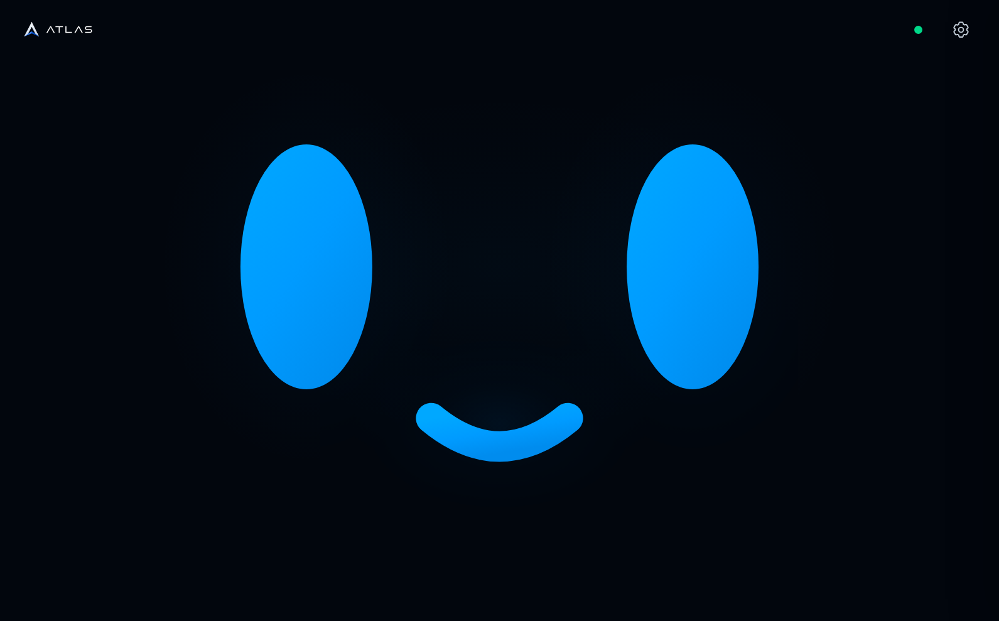

<p align="center">
  
</p>

<h1>
</h1>

ATLAS es un prototipo de agente de inteligencia artificial físico, personalizable y de bajo coste. Integra OpenClaw, modelos de lenguaje, memoria persistente, herramientas del sistema y distintos canales de comunicación en un dispositivo dedicado.

El objetivo no es presentar ATLAS como una inteligencia consciente ni como un modelo creado desde cero. El proyecto estudia cómo desplegar, configurar, personalizar y evaluar un agente basado en tecnologías abiertas para que pueda ejecutar tareas concretas de forma útil, natural y verificable.

## Qué es ATLAS

ATLAS busca superar el enfoque rígido de los asistentes basados únicamente en comandos predefinidos. Puede interpretar peticiones en lenguaje natural, utilizar tools, consultar memoria, interactuar con el sistema y coordinar acciones dentro de los límites definidos por el usuario.

OpenClaw mantiene la autenticación y sus canales de agente. WebScreen utiliza una ruta directa de Realtime con contexto y herramientas, sin consultar obligatoriamente a otro agente. El conjunto conecta:

- Large Language Models (LLM), principalmente mediante servicios en la nube.
- Memoria y contexto persistentes escritos en Markdown.
- Tools, skills, scripts y servicios del sistema.
- Channels como Telegram, interfaces web y futuras integraciones.
- Pipelines de Speech-to-Text (STT) y Text-to-Speech (TTS).

ATLAS es la capa de identidad, comportamiento, integración, automatización y experiencia física construida alrededor de esa base.

## Objetivos

- Mantener conversaciones por texto y, progresivamente, por voz.
- Recordar preferencias concretas del usuario de forma estructurada.
- Ejecutar tareas mediante tools y comandos del sistema.
- Mostrar información en una pantalla dedicada.
- Integrar canales de comunicación y servicios externos.
- Detectar e interpretar determinados periféricos conectados.
- Recuperar sus servicios después de un reinicio.
- Evaluar cada función mediante éxito, errores y tiempo de respuesta.

## ATLAS A1

ATLAS A1 es la primera implementación física del proyecto. Actualmente se ejecuta en una Raspberry Pi 5 con 4 GB de RAM.

La Raspberry Pi actúa como Gateway, entorno de ejecución y punto de conexión con el hardware. Los modelos más grandes se ejecutan normalmente en la nube; los modelos locales se reservan para tareas compatibles con los recursos disponibles, como determinados procesos de STT, TTS o experimentación con modelos pequeños.

La pantalla actual es una SunFounder TS7 Pro táctil de siete pulgadas y resolución 1024 × 600. El diseño físico completo, el audio, el micrófono y la carcasa se documentarán conforme avance el prototipo.

## Software

ATLAS OS 1.0 está basado en Debian 13 para arquitectura `aarch64` y personalizado para funcionar como sistema dedicado de ATLAS. Incluye la identidad visual del proyecto, OpenClaw, servicios persistentes y comandos específicos para controlar el dispositivo.

<p align="center">
  
</p>

La versión mostrada utiliza:

- Hostname `atlas-a1`.
- Identidad `ATLAS OS 1.0 (Debian 13)`.
- Shell presentada como `atsh 1.0`, basada en Bash.
- Fastfetch y Neofetch con identidad visual propia.
- OpenClaw como Gateway del agente.

### WebScreen y conversación por voz

El código de [`ATLAS WebScreen`](.atlas/webscreen) conserva la interfaz de depuración con ATLAS, Transcripción, Texto a voz, Wake word, Doble aplauso y Ajustes.

The new [minimal face design](.atlas/webscreen/NEW_DESIGN.md) is available at
`/new/` and with `atlas-screen --atlas-new`. Its browser-rendered blue face
blinks while waiting, transforms into an input-level waveform after ATLAS,
and animates its mouth during actual playback, without transcript/status text.
The quiet HUD keeps only the brand, connection indicator and settings access.
The original `/` and `--atlas` remain the debugging presentation; both share
the same Realtime session logic, tools, context and access controls. Their
drawers link to **New Webscreen** / **Debugging Webscreen** on the same host,
including trusted LAN devices.

The same Realtime model chooses the face's cartoon expression through a local
visual tool. Repeated back-and-forth touchscreen caresses over a full-face
circle make it delighted with a soft lift/settle animation. Randomized blinks
reveal two discrete drowsy poses at 50–55 and 75–80 seconds before sleep at
100–105 seconds; the idle face never continuously squeezes its eyes shut. Sleep
is decorative and never switches off wake recognition or delays input.
Browse the [implemented expressions and sleep state](docs/images/webscreen-expressions/README.md):
these are native WebScreen browser captures, not generated design mockups.

El drawer compartido permite calibrar un doble aplauso en cinco pruebas locales.
El navegador deriva solo umbrales resumidos de envolvente, ataque, transitorios
y espectro a partir del analizador del micrófono existente: no almacena ni sube
audio. Dos aplausos completos, separados y acústicamente similares mientras la
cara espera muestran la expresión local `defiant` durante
tres segundos, sin abrir ni interrumpir una conversación de Realtime. El perfil
es privado del A1 y se puede recalibrar si cambian la sala o el micrófono; el
diseño, límites y verificación física están en
[`.atlas/webscreen/CLAP.md`](.atlas/webscreen/CLAP.md).

Browser previews: [ready](docs/images/webscreen-new/idle.png),
[listening](docs/images/webscreen-new/listening.png),
[thinking](docs/images/webscreen-new/thinking.png),
[speaking](docs/images/webscreen-new/speaking.png), and
[1024 × 600](docs/images/webscreen-new/pi-1024x600.png).
These earlier previews are controlled browser captures; the [verification notes](.atlas/webscreen/NEW_DESIGN.md#earlier-browser-verification)
distinguish presentation checks and real PCM/MediaStream tests from physical
microphone/speaker validation.
The [installed A1 screenshot](docs/images/webscreen-new/pi-live.png) separately
shows the actual 1024 × 600 display after deployment.



Una sola pestaña controla WebScreen a la vez. Las demás muestran **Tomar control**: al pulsarlo, el permiso pasa inmediatamente al nuevo dispositivo, sin solicitud ni confirmación. La pestaña anterior detiene micrófono, audio y trabajo activo y muestra la pantalla bloqueada. La conversación de OpenClaw se conserva; este control de uso no sustituye una futura autenticación.

- `gpt-realtime-2.1` conversa, razona y utiliza `atlas_shell`, `atlas_web_search` (Tavily), `atlas_routine`, `atlas_phone` y `atlas_android` directamente. Recibe identidad, Markdown, informes actuales y contexto conversacional; no usa el preámbulo ni `openclaw_agent_consult` del pipeline antiguo. Las tools del móvil tienen allowlists cerradas: la ruta nativa es prioritaria, Android Use pulsa etiquetas accesibles antes de recurrir a coordenadas y conserva la sesión tras errores visuales recuperables.
- Las rutinas deterministas se guardan en `.atlas/routines/ROUTINES.md`. Una
  frase exacta se resuelve localmente antes de abrir una respuesta de Realtime,
  con pasos de shell, variables capturadas y respuesta `[SAY]` opcional.
  `requires_model: false` hace que el `[SAY]` resuelto sea toda la respuesta,
  sin modelo; `true` entrega al modelo el resultado ya ejecutado. Se
  crean y administran hablando con ATLAS o por SSH mediante `atlas-routines`;
  un fallo se entrega al modelo para explicarlo sin repetir la acción.
- `atlas-chat` abre esa misma ruta Realtime en la terminal, solo por texto, con
  el mismo OAuth, instrucciones, contexto y herramientas. Transmite la respuesta
  en blanco y separa en gris cada comando, búsqueda y salida real, además de
  mostrar tiempos de primer texto y finalización.
  Las sesiones normales comparten la conversación persistente de WebScreen;
  `--ephemeral` no la lee ni la modifica. Una capa final adapta únicamente la
  presentación al terminal, permitiendo Markdown, rutas, cifras y unidades.
  Incluye sugerencias de comandos `/`, referencias a archivos `@`, entrada
  multilínea y herramientas compactas con `/expand` para consultar el detalle.
  También comparte las tools tipadas `atlas_phone` y `atlas_android`: prioriza
  APIs nativas del móvil y, cuando necesita ver la pantalla, adjunta la captura
  JPEG privada, reducida a 640 px de ancho, como `input_image` separado. La
  imagen no se vuelca en texto/base64; el control visual se detiene al completar
  o abandonar la tarea y ante una pérdida terminal, no por un error corregible.
- Chrome detecta la palabra exacta `Atlas`, también dentro de una frase, sin silencio previo ni veto semántico. En A1 y navegadores remotos, Chrome entrega la petición y las continuaciones como texto a Realtime, descartando duplicados de la transcripción auxiliar. `gpt-4o-mini-transcribe` aporta una transcripción auxiliar de los turnos de audio, no el razonamiento.
- Solo en A1, el micrófono y el detector se bloquean durante la reproducción y 200 ms después. El resto de dispositivos conserva sus interrupciones naturales. Al terminar la respuesta se vuelve a esperar la palabra Atlas: ya no se abre una continuación automática de diez segundos.
- Se pueden elegir voces nativas de OpenAI, navegador o ElevenLabs, y esfuerzo Default, Minimal, Low, Medium, High y Xhigh, según admita el proveedor. ElevenLabs usa por defecto `eleven_flash_v2_5` y el proxy reenvía cada fragmento HTTP disponible sin esperar un bloque completo de 8 KiB. Default omite el ajuste de razonamiento. Los resultados provisionales de Chrome se sustituyen al corregirse y el texto idéntico no reinicia la espera.
- Las reservas WebRTC son efímeras. El OAuth persistente y las credenciales permanecen en la Raspberry Pi y no se entregan al navegador.
- Cada interacción directa o delegada se registra en JSON Lines con tiempos, transcripción, modelo, voz, tool calls y resultado, sin incluir secretos.
- Si Realtime o WebRTC fallan, se intenta reconectar sin cambiar silenciosamente al agente antiguo. Su código histórico está preservado en [`Backups/WebScreen/legacy-preamble-2026-08-29`](Backups/WebScreen/legacy-preamble-2026-08-29).

OpenClaw sigue disponible en otros canales, pero el WebScreen actual recibe su contexto y actúa con herramientas directas de Realtime. Los ajustes experimentales de audio del A1 no se aplican al portátil.

La recuperación distingue HTTP, permisos de página, Gateway, WebRTC y audio físico. Tolera pérdidas breves, renueva tokens caducados y detecta respuestas bloqueadas sin repetir acciones automáticamente. El [mapa de conexiones](openclaw/workspace/ATLAS-CONNECTIONS.md) enlaza los componentes, diagnósticos e instaladores. La [verificación de septiembre](docs/WEBSCREEN-RELIABILITY-2026-09-06.md) recoge pruebas, tiempos y límites de la validación.

### App Android · preview 0.2.6

La [APK ATLAS](android/README.md) incorpora voz por pulsación, wake word en primer plano y chat progresivo, acciones configurables mediante presets, terminal PTY persistente, estado cacheado y protección biométrica. Usa la paleta oscura de ATLAS, ofrece revisión de permisos pendientes —incluida Accesibilidad—, actualizaciones verificadas desde las releases Android y widgets redimensionables desde 2×2 para acciones, estado, cuotas y accesos a Chat/Voz. La versión 0.2.6 aparca WebRTC, audio, animaciones y todo el renderer al quedar en segundo plano, dejando únicamente el enlace ligero con A1; además encadena automáticamente Android Use tras una apertura nativa cuando el usuario pide una acción dentro de la app. «Controla mi teléfono» sigue iniciando una sesión explícita entre varios mensajes sin navegar por su cuenta.

[ATLAS Companion](.atlas/companion/README.md) es un servicio separado para la app, con emparejamiento BLE privado, TLS fijado y mensajes AES-GCM. El transporte es un WebSocket persistente al endpoint Tailscale `100.x`: en la misma LAN se prefiere la ruta P2P directa y DERP cifrado sigue siendo un fallback válido, sin dominio, VPS ni puertos públicos. `atlas-app control` prioriza APIs nativas del móvil; `atlas-androiduse` limita la automatización visual con accesibilidad, clicks semánticos, coordenadas normalizadas y capturas privadas. El servidor procesa RPC concurrente para poder recibir `app.reply` mientras espera una operación nativa reentrante. El antiguo relay de Cloudflare queda solo para compatibilidad explícita y nunca se activa automáticamente al fallar Tailscale. Nunca se expone WebScreen al exterior.

### Pantalla y terminal local

`atlas-screen` reports physical display state and selects `--desktop`, `--terminal`,
`--atlas` (debug), `--atlas-new` (minimal face), `--atlas-hide` or `--rafas`.
`on` opens the selected mode; `off` powers the output down. `enable --atlas-new`
or another mode configures startup; `enable --last` restores the last selection,
and `disable` starts with the display off. Visible ATLAS modes share a sandboxed
Chrome kiosk over localhost. The hidden mode keeps that same voice session and
HDMI audio alive behind a black, minimum-brightness cover. The cursor is hidden
unless a USB/Bluetooth mouse is connected. [Full command guide](atlas-commands/README.md#atlas-screen).

La terminal usa Zsh con autocompletado, highlighting y **ATLAS TOUCH TYPE**, el teclado táctil oscuro. Un doble toque abre el teclado sin tapar la zona de escritura; un toque lo cierra y dos dedos permiten recorrer el historial. El zoom cambia la letra y reajusta las líneas sin cambiar la ventana. Esta terminal tiene acceso root local: úsala únicamente en un dispositivo bajo tu control. RAFAS es su alternativa de recuperación sin entorno gráfico.

## Workspace de OpenClaw

El directorio [`openclaw/workspace`](openclaw/workspace) contiene la base pública del contexto de ATLAS.

- `AGENTS.md`, `IDENTITY.md` y `SOUL.md` conservan el comportamiento e identidad definidos para ATLAS.
- `USER.md`, `MEMORY.md`, `TDR.md`, `ENVIRONMENT.md` y `HEARTBEAT.md` se distribuyen como templates sin datos personales.
- `TOOLS.md` sirve como guía local para documentar hardware, rutas y herramientas de cada instalación.
- `VARIABLES.md`, `ADB.md` y `NMAP.md` son templates; `atlas-commands/` contiene las instrucciones de los comandos para el agente.

### Dispositivos Android y red local

ATLAS puede utilizar ADB para conectarse a teléfonos, televisores y otros dispositivos Android autorizados. Un wrapper transparente conserva el comando `adb` habitual y, después de una conexión correcta, crea en segundo plano una ficha privada y reproducible con la identidad, versión de Android, codename, build, pantalla, batería y almacenamiento del dispositivo. Las reconexiones actualizan la ficha identificada por MAC en vez de duplicarla.

Un temporizador independiente mantiene cada diez minutos un informe privado de los hosts activos y de los servicios TCP más comunes de la red local. ATLAS consulta primero ese informe para responder preguntas rápidas o localizar una IP. Los escaneos completos de todos los puertos se reservan para un objetivo privado concreto y una petición que realmente los necesite.

Los tokens, API keys, sesiones, credenciales, historiales, datos personales y configuraciones privadas no forman parte del repositorio ni de las imágenes publicadas.

## Comandos de ATLAS

La carpeta [`atlas-commands`](atlas-commands) contiene los comandos `atlas-*` utilizados para gestionar audio, Spotify, pantalla, casting, estado del sistema, TTS, servicios del dispositivo, rutinas y el cliente Realtime de terminal. Cada comando se acompaña de una descripción breve y ejemplos de uso.

Para instalar o actualizar el chat de terminal en ATLAS A1, conservando copias
fechadas y dejándolo disponible tanto para `sami` como para root:

```bash
sudo bash system/install-chat.sh
```

## Estructura del repositorio

Las [herramientas misceláneas](misc/README.md) reúnen [ATLAS TOUCH TYPE](misc/atlas-touch-type/README.md) y [RAFAS](misc/rafas/README.md), con su código y notas de instalación.

```text
ATLAS/
├── .atlas/                 Runtime público: WebScreen, desktop, pantalla y proyectos
├── assets/                 Recursos visuales y capturas
├── android/                App ATLAS, fuentes y construcción de APK
├── atlas-commands/         Comandos de administración de ATLAS A1
├── docs/                   Notas de versiones y documentación técnica
├── misc/                   ATLAS TOUCH TYPE, RAFAS y herramientas misceláneas
├── openclaw/workspace/     Identidad pública y templates de OpenClaw
├── system/                 Helpers, servicios, ADB, Nmap, terminal, HDMI y personalización
├── README.md               Presentación del proyecto
└── SECURITY.md             Política de publicación segura
```

## Estado actual

ATLAS se encuentra en desarrollo activo. La versión 1.0 establece la identidad del agente, su sistema operativo base, el Gateway de OpenClaw, el contexto persistente y las primeras herramientas de control.

La voz, la pantalla táctil y las herramientas de recuperación están en desarrollo activo. El código de este repositorio avanza por delante de la imagen de la release 1.0: esta actualización no genera ni sustituye ninguna imagen del sistema. Consulta el [mapa de instalación y límites actuales](.atlas/README.md).

## RAFAS

RAFAS significa ***Recovery Access For ATLAS Systems***. Su primera implementación ya permite abrir una consola de recuperación local independiente del entorno gráfico, de OpenClaw y de la red.

Durante el desarrollo de ATLAS A1 fueron apareciendo errores e incidencias. Habitualmente, ATLAS podía resolverlos por sí mismo o recuperarse mediante sus herramientas de auto-reparación. Sin embargo, algunos fallos afectaban al propio Gateway de OpenClaw, al provider del modelo —por ejemplo, OpenAI— o a NetworkManager. En esas situaciones, ATLAS entraba en un estado de hibernación operativa y no podía reparar el problema desde dentro.

Hasta entonces, la alternativa era conectarse por SSH a la terminal de ATLAS OS y resolverlo manualmente. Esto se volvía especialmente complicado si el fallo estaba relacionado con la conectividad: si la Raspberry Pi no conseguía conectarse a Internet, tampoco era posible acceder a ella por red.

Con la incorporación de la pantalla al ATLAS A1 surgió RAFAS. Con un teclado USB, mantén Ctrl y pulsa W, O, W. La pantalla se enciende y muestra el logo de ATLAS y el título R.A.F.A.S. en blanco, junto a una shell root en `/home/atlas`. También se abre con `atlas-screen --rafas`. Funciona desde los modos apagado, desktop, terminal o Atlas; no necesita Chrome ni Xorg.

Un pequeño servicio espera eventos del teclado, sin sondeo periódico ni registro de pulsaciones. Se inicia con el sistema y se reinicia si falla. No es un sistema operativo alternativo: necesita que Linux, systemd, el teclado y la pantalla sigan funcionando.

`atlas-rafas` añade un diagnóstico de Wi-Fi, rutas, DNS, HTTPS, reloj, almacenamiento, memoria, temperatura, alimentación, USB y servicios. `atlas-rafas doctor` recupera servicios habilitados y ofrece conexión Wi-Fi interactiva cuando falta red; `doctor --check` no modifica nada. No borra datos, resetea OAuth ni reinicia redes sanas. Consulta su [manual](openclaw/workspace/atlas-commands/ATLAS-RAFAS.md).

**Esta versión de desarrollo ofrece acceso root local sin contraseña adicional.** Está pensada exclusivamente para dispositivos bajo control de su propietario. La autenticación y las herramientas visuales de recuperación se incorporarán más adelante. [Código, funcionamiento y límites](misc/rafas/README.md).

### Roadmap

- Desarrollar **ATLAS Imager** para Windows y Linux.
- Descargar, verificar, descomprimir y grabar automáticamente la imagen oficial de ATLAS OS.
- Permitir el provisioning previo de Wi-Fi, hostname, usuario, contraseña y claves SSH sin incluir estos datos en la imagen pública.
- Definir un formato de configuración versionado para que ATLAS Imager y ATLAS OS sean compatibles entre versiones.

## Releases

Las imágenes saneadas de ATLAS OS y sus notas de versión se publican en [GitHub Releases](https://github.com/samilososami/ATLAS/releases). Se distribuyen comprimidas como `.img.xz`; ATLAS Imager podrá descargarlas y preparar cada instalación con la configuración elegida por su propietario. Una imagen pública nunca debe contener redes Wi-Fi, tokens, API keys, cookies, sesiones, claves SSH ni datos personales de la instalación original.

Consulta las [notas de ATLAS OS 1.0](docs/ATLAS-OS-1.0.md) para conocer el contenido, los requisitos, el proceso de primer arranque y las comprobaciones de seguridad.

## Donaciones

Cualquier donación me motiva muchísimo y me ayuda a continuar creando, investigando y explorando nuevos proyectos.

- PayPal: [paypal.me/samilososami](https://paypal.me/samilososami)
- Bitcoin: `bc1qa8r8ll0m0e58f3ngrauh08nnzdn0alm825nc3r`

## TO-DO

- [ ] Diseñar un algoritmo de canciones opt-in que analice el historial local de Spotify, detecte patrones de escucha y proponga acciones explicables sin saltar ni modificar música automáticamente.
