# ATLAS · implemented facial expressions

These PNGs are **screenshots of the actual WebScreen SVG/CSS renderer** in
Chromium at **1591 × 989**, not the image-generated concept art. Each expression
was selected internally with `AtlasFace.expression(...)` after loading the real
presentation assets, except `defiant`, which uses the production-only local
`AtlasFace.clap()` gesture entry point. The approved neutral sizing, spacing,
palette and HUD are shared by every expression. The delighted eyes use the
revised, higher cutouts.

The motion revision brings eye centers another 5% closer together, adds a
progressive happy reaction and a four-stage decorative sleep cycle. The two
drowsy screenshots and the asleep screenshot use the real inactivity deadlines
with an accelerated test clock; selected CSS animation frames are paused only
for the static asleep capture. These are not emotions exposed to the model.

The capture fixture sets idle state and a green connection indicator locally;
these gallery shots demonstrate appearance, not a live Internet connection,
model response, microphone or physical speaker test. No voice session is opened
and no user conversation is included in the published images.

The separate [actual A1 display sequence](../webscreen-motion/) shows the
installed sleep and upper-face petting cycle, captured in real time.

| Expression | Expression |
| --- | --- |
| Neutral  | Angry 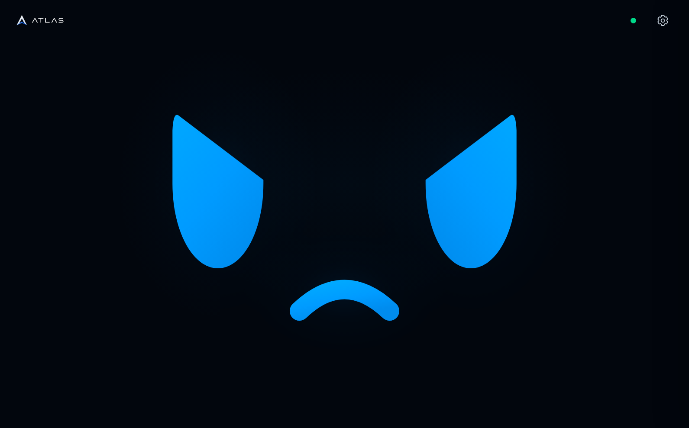 |
| Delighted 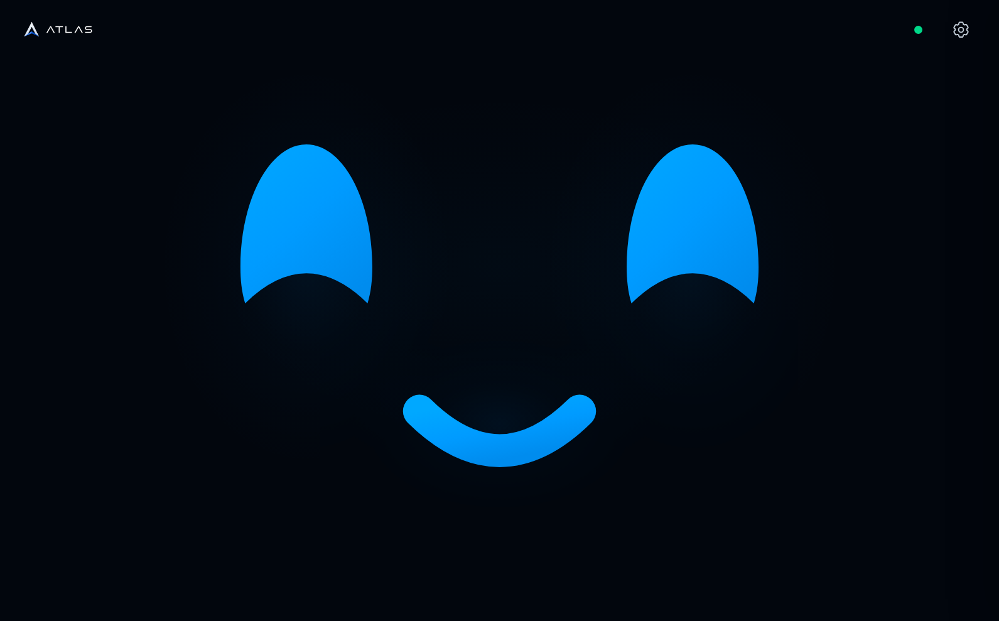 | Surprised 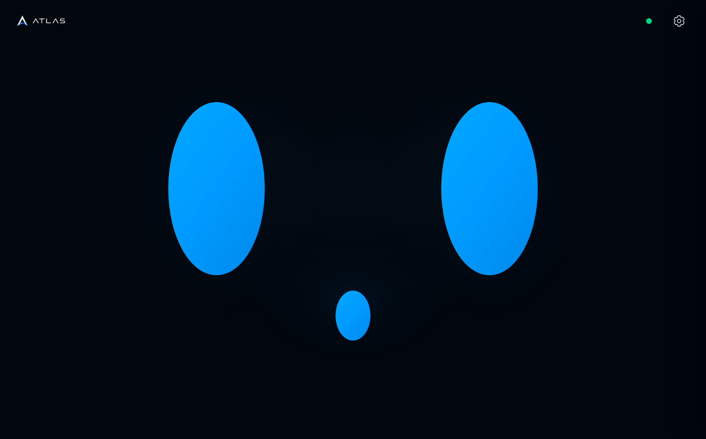 |
| Curious 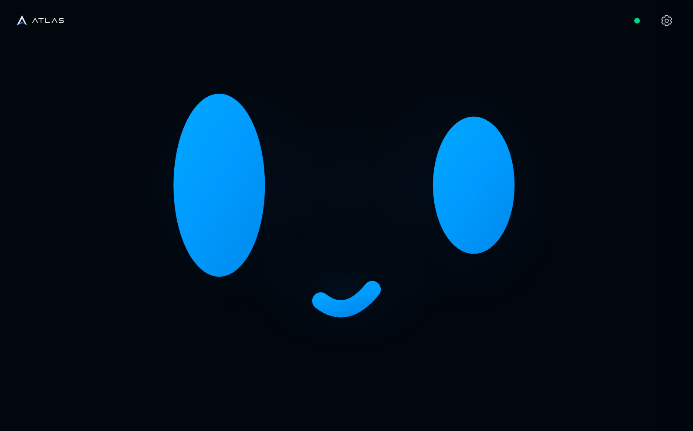 | Skeptical 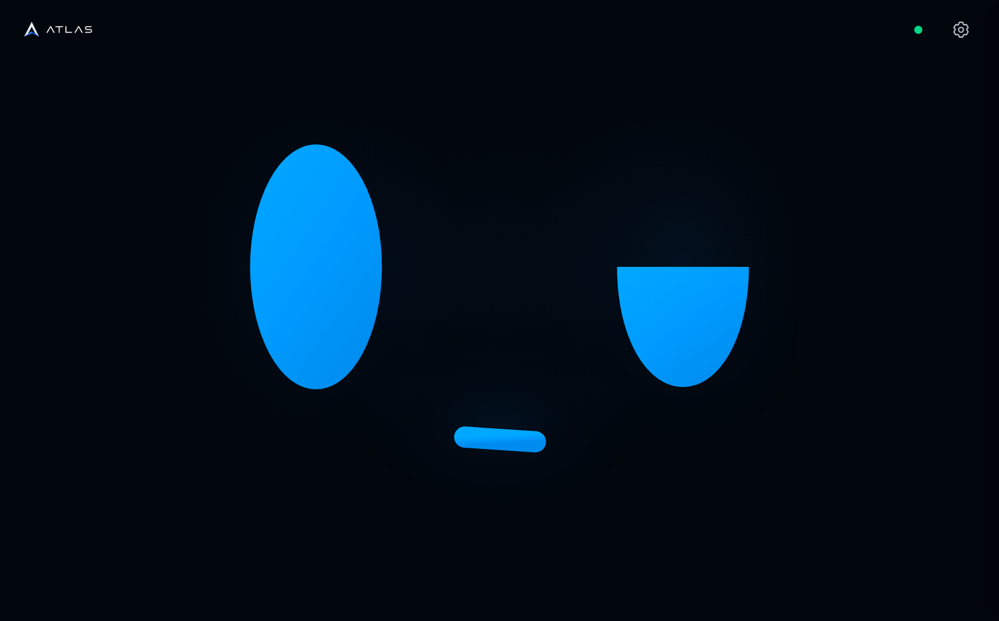 |
| Sad 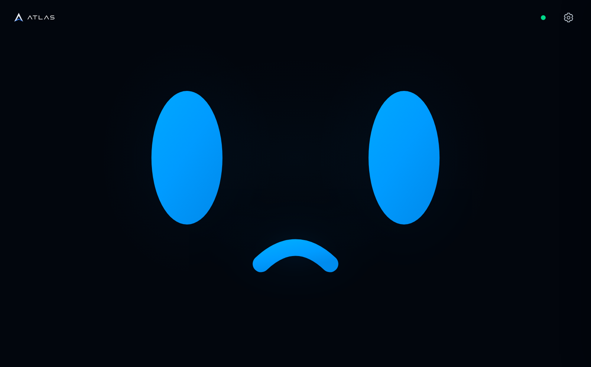 | Worried 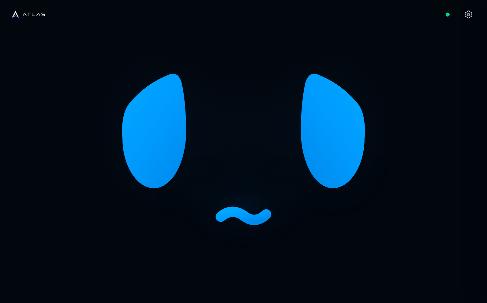 |
| Sleepy 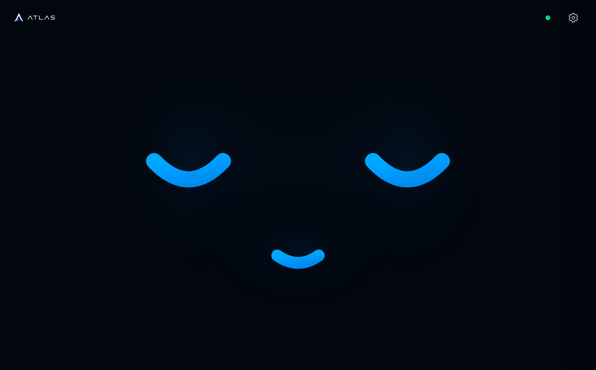 | Wink 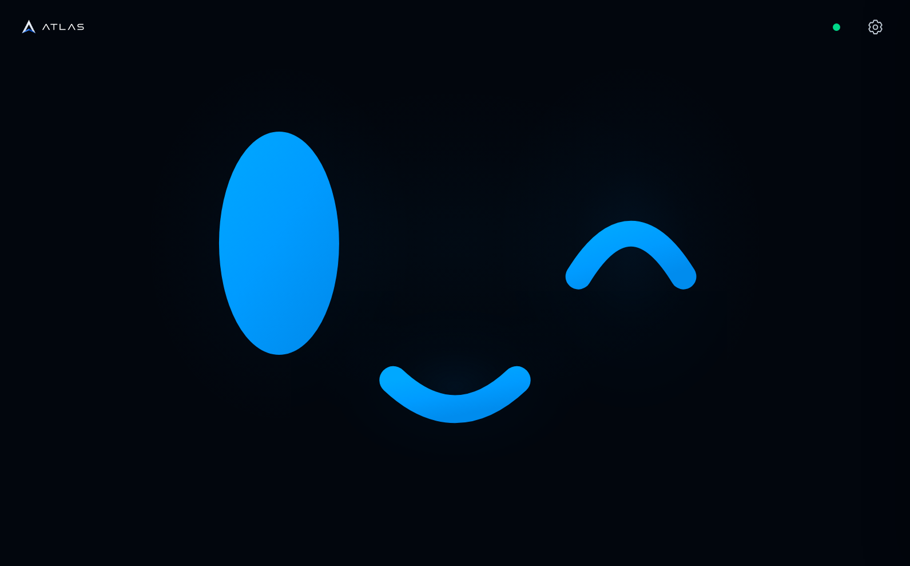 |
| Laughing 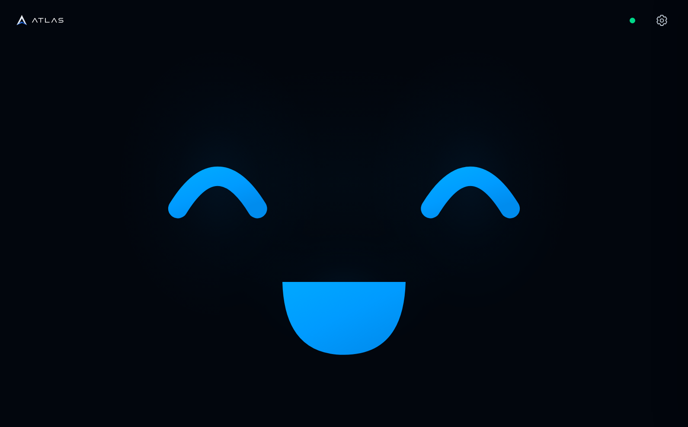 | Focused 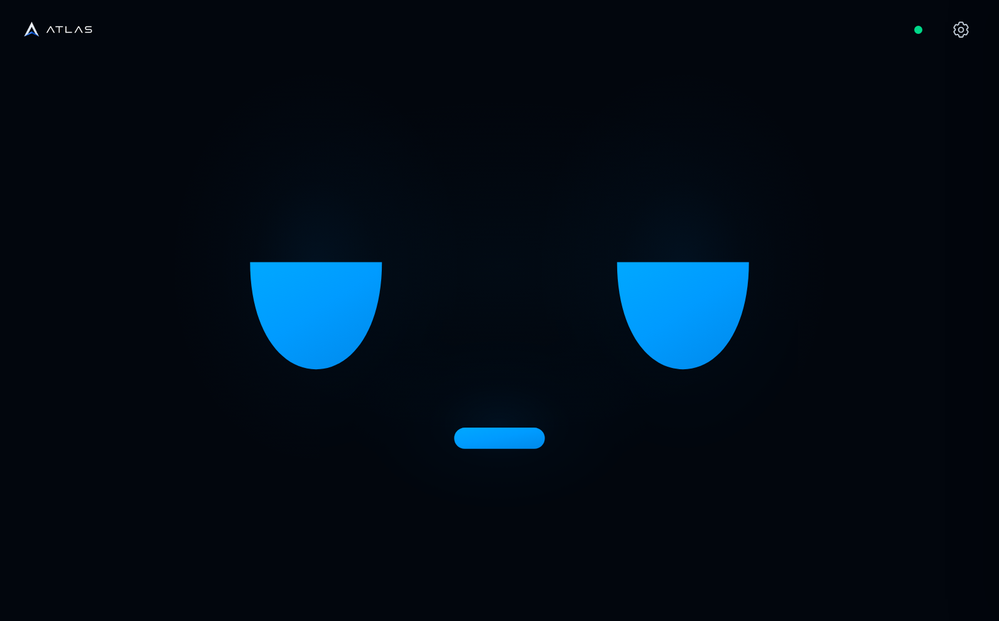 |
| Shy 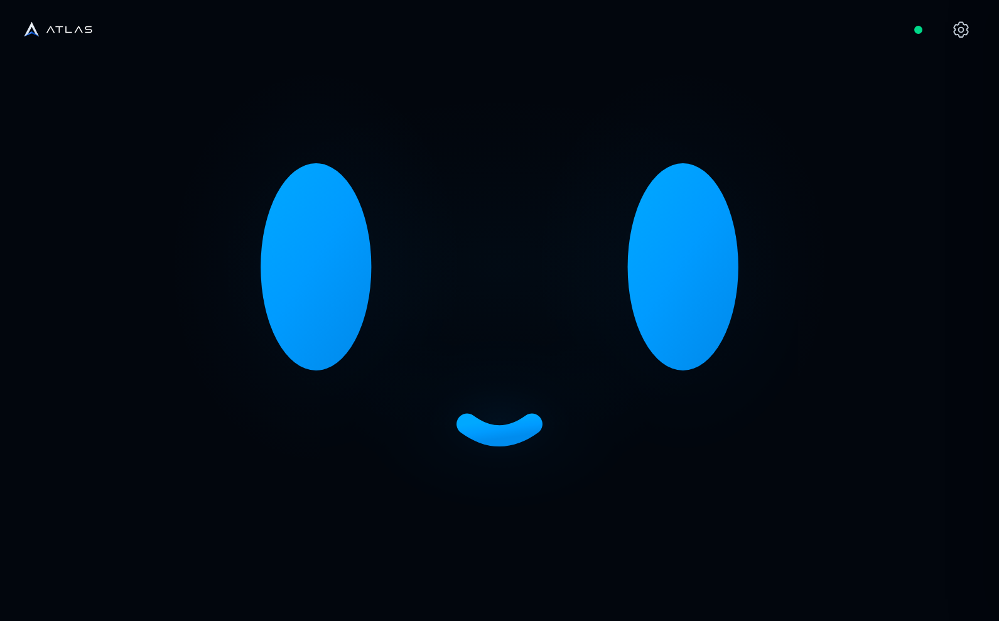 | Defiant (local double applause) 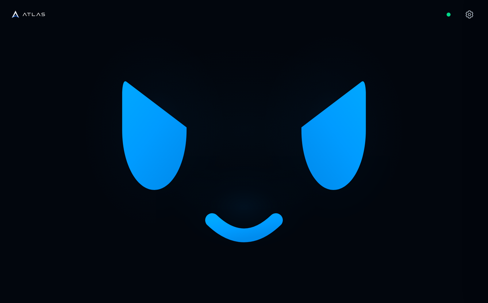 |
| Drowsy 1 (50–55 s) 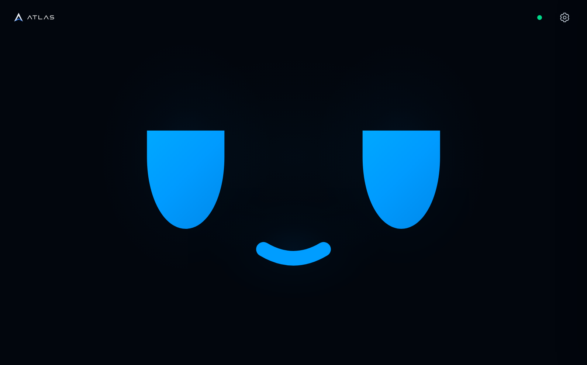 | Drowsy 2 (75–80 s) 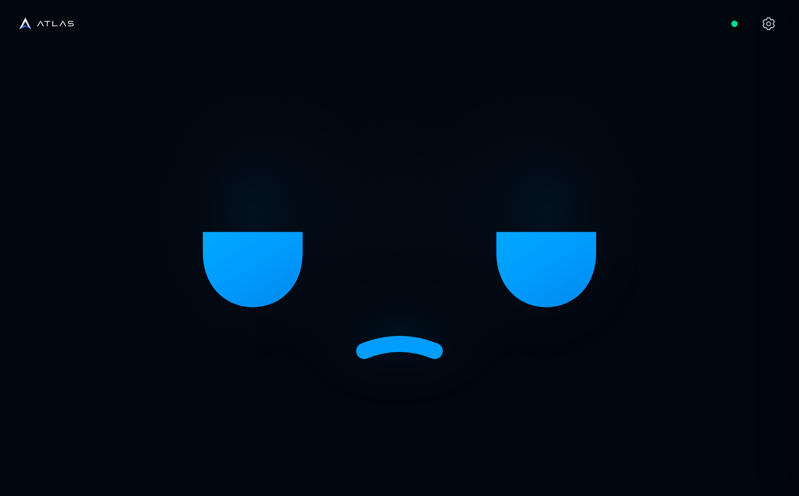 |
| Asleep (100–105 s) 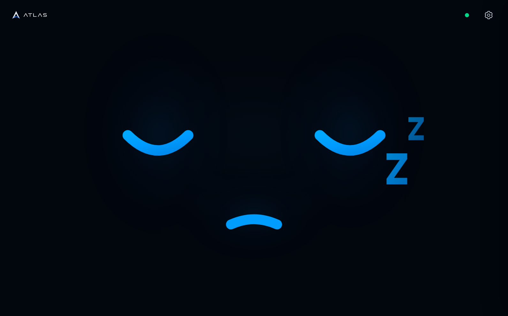 | |

## Reproduce the screenshots

With Node.js and Playwright available, run from the repository root:

```sh
node .atlas/webscreen/capture_face_expressions.cjs
```

Set `ATLAS_CHROME` to a local Chrome executable if not using Playwright's
bundled Chromium; `NODE_PATH` may point to an already-installed Playwright.
The fixture binds an ephemeral **loopback-only** port, serves the production
presentation files, captures all thirteen model expressions plus the local
defiant gesture and all three inactive poses, then closes the browser.
`--serve` leaves the isolated presentation preview on `127.0.0.1:5059` for visual
inspection. Neither mode changes the real A1 kiosk or bypasses its access lease.

See the [design, interaction and verification contract](../../../.atlas/webscreen/NEW_DESIGN.md#semantic-expressions-and-touchscreen-caresses)
for semantic model selection, bounded expression lifetimes and local petting.
