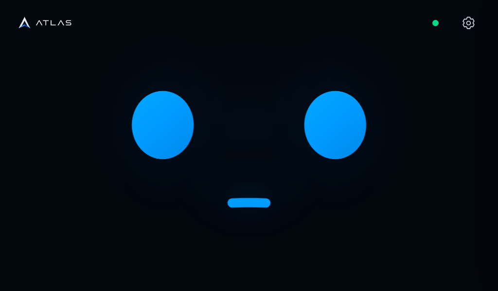
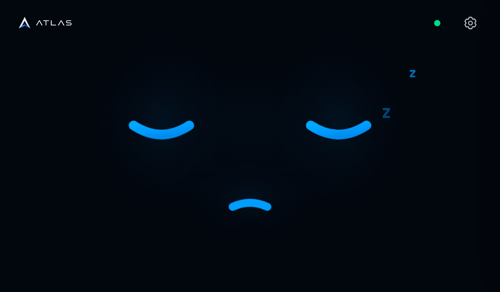
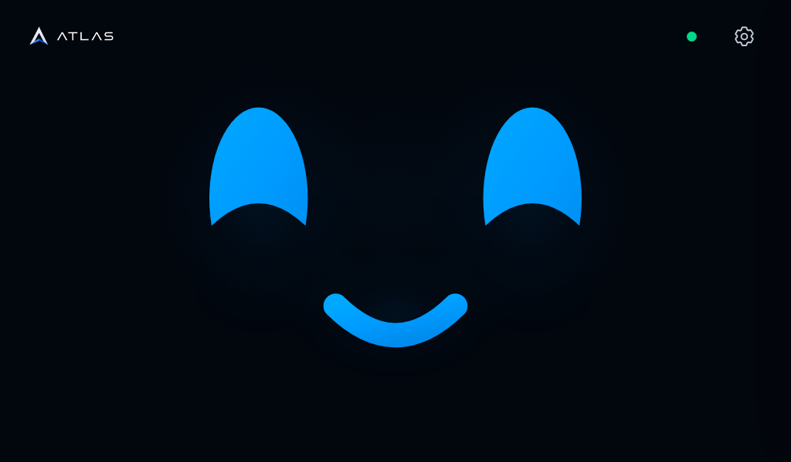
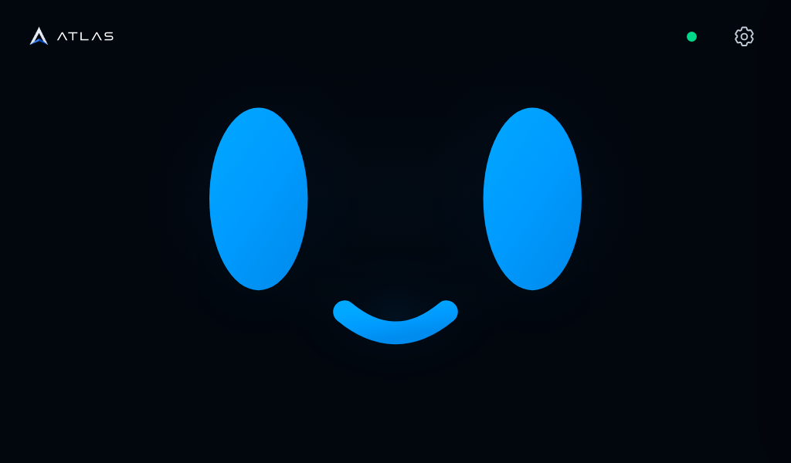

# WebScreen motion · actual A1 display

Unedited **1024 × 600 X11 screenshots from the Raspberry Pi**, after deploying
the motion revision on 2026-09-07. These are not generated concept images or a
mock browser connection. The normal WebScreen, live lease and audio controller
were running; no forced emotion or sleep API was used for these captures.

The test clicked the upper face once to reset decorative inactivity, waited in
real time, then performed four deliberate mouse strokes across the **upper
face at y=150** using X11. Mouse input tests the actual pointer-event route; it
does not constitute a physical finger or microphone/speaker test.

| Captured state | Elapsed | Screenshot |
| --- | --- | --- |
| Neutral after contact | 0.7 s |  |
| Progressive drowsiness | 50.3 s |  |
| Asleep, breathing and fading Z | 63.5 s |  |
| Awake and delighted after four upper-face strokes | 65.9 s |  |
| Returned to neutral | 72.4 s |  |

The initial visual deployment and this capture sequence reused the same Chrome
process. The subsequent kiosk-watchdog update required a kiosk-service restart
so manual switches between the two views are not mistaken for page failures.
Real-time audio processing was not changed. Deterministic browser tests separately verify
waking/listening with input RMS before the 180 ms surprise ends; they are not
measurements of live model latency. The complete [motion contract and test
results](../../../.atlas/webscreen/NEW_DESIGN.md#motion-revision-verification--2026-09-07)
explain timing, reduced motion and resource cleanup.

See also the [full native expression gallery](../webscreen-expressions/).
